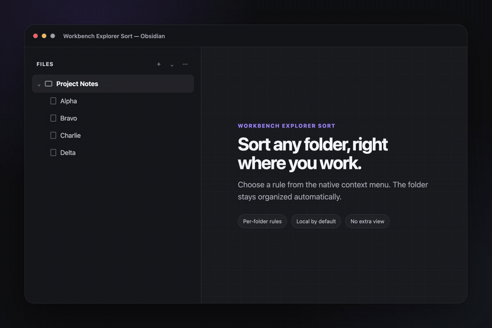

# Workbench Explorer Sort

<p align="center">
  <strong>Per-folder sorting, directly in Obsidian's native File Explorer.</strong>
</p>

<p align="center">
  <a href="https://github.com/IvyYang1999/obsidian-workbench-explorer-sort/releases/latest"></a>
  <a href="https://github.com/IvyYang1999/obsidian-workbench-explorer-sort/blob/main/LICENSE"></a>
  <a href="https://obsidian.md/plugins?id=workbench-explorer-sort"></a>
</p>

<p align="center">
  
</p>

Workbench Explorer Sort adds persistent sorting rules to individual folders in Obsidian's native file tree. Right-click a folder, choose a rule, and keep working—there is no separate view to manage.

## Why it is useful

- **Folder-specific:** sort project notes alphabetically while keeping a journal newest-first.
- **Native workflow:** every rule lives in the File Explorer context menu.
- **Persistent:** rules survive restarts and follow folders when they are renamed.
- **Private by default:** the plugin makes no network requests and stores settings in your vault's local plugin data.

## Sort modes

| Field | Directions |
| --- | --- |
| Name | A → Z, Z → A |
| Created time | New → Old, Old → New |
| Modified time | New → Old, Old → New |

## Use it

1. Right-click any folder in **Files**.
2. Choose **Sort rules**.
3. Pick **Name**, **Created time**, or **Modified time**, then choose a direction.

To return the folder to Obsidian's default order, choose **Sort rules → Clear sort rule**.

## Install

### Community plugins

1. Open **Settings → Community plugins → Browse**.
2. Search for **Workbench Explorer Sort**.
3. Select **Install**, then **Enable**.

[Open the plugin listing](https://obsidian.md/plugins?id=workbench-explorer-sort)

### Manual installation

Download `main.js`, `manifest.json`, and `styles.css` from the [latest release](https://github.com/IvyYang1999/obsidian-workbench-explorer-sort/releases/latest), then place them in:

```text
<vault>/.obsidian/plugins/workbench-explorer-sort/
```

Reload Obsidian and enable the plugin under **Settings → Community plugins**.

## Optional CLI

`cli.js` lets local scripts and agents read or update the same rules. It is included in GitHub releases but is not installed by Obsidian's Community Plugins browser.

Run it from a vault root:

```bash
node /path/to/cli.js list
node /path/to/cli.js get "Project Notes"
node /path/to/cli.js set "Project Notes" name-desc
node /path/to/cli.js clear "Project Notes"
```

Pass `--vault /path/to/vault` when running it from another directory. Supported mode values are `name-asc`, `name-desc`, `ctime-desc`, `ctime-asc`, `mtime-desc`, `mtime-asc`.

## Compatibility

- Obsidian 1.13.0 or later
- Desktop only

## Development

```bash
npm ci
npm run check
npm run dev
```

See [CONTRIBUTING.md](CONTRIBUTING.md) for the contribution workflow.

## License

[MIT](LICENSE) © IvyYang1999
